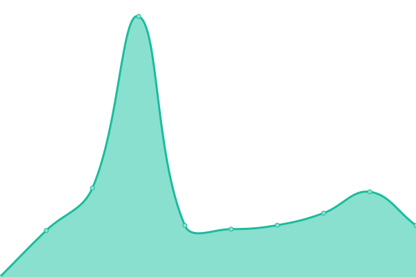

# [📈 Live Status](https://adaptivehealthintelligence.github.io/site-monitoring): <!--live status--> **🟩 All systems operational**

This repository contains the open-source uptime monitor and status page for [Adaptive Health Intelligence](https://adaptivehealthintelligence.org.au/), powered by [Upptime](https://github.com/upptime/upptime).

With [Upptime](https://upptime.js.org), you can get your own unlimited and free uptime monitor and status page, powered entirely by a GitHub repository. We use [Issues](https://github.com/adaptivehealthintelligence/site-monitoring/issues) as incident reports, [Actions](https://github.com/adaptivehealthintelligence/site-monitoring/actions) as uptime monitors, and [Pages](https://adaptivehealthintelligence.github.io/site-monitoring) for the status page.

<!--start: status pages-->
<!-- This summary is generated by Upptime (https://github.com/upptime/upptime) -->
<!-- Do not edit this manually, your changes will be overwritten -->
<!-- prettier-ignore -->
| URL | Status | History | Response Time | Uptime |
| --- | ------ | ------- | ------------- | ------ |
|  PlatinumC | 🟩 Up | [platinum-c.yml](https://github.com/adaptivehealthintelligence/site-monitoring/commits/HEAD/history/platinum-c.yml) | 

 1536ms
     
 | 

<a href="https://adaptivehealthintelligence.github.io/site-monitoring/history/platinum-c">100.00%</a>
    

|  AUTOMATIC | 🟩 Up | [automatic.yml](https://github.com/adaptivehealthintelligence/site-monitoring/commits/HEAD/history/automatic.yml) | 

 1483ms
     
 | 

<a href="https://adaptivehealthintelligence.github.io/site-monitoring/history/automatic">100.00%</a>
    

|  COVID-I Dashboard | 🟩 Up | [covid-i-dashboard.yml](https://github.com/adaptivehealthintelligence/site-monitoring/commits/HEAD/history/covid-i-dashboard.yml) | 

 1062ms
     
 | 

<a href="https://adaptivehealthintelligence.github.io/site-monitoring/history/covid-i-dashboard">100.00%</a>
    

|  MotC Project | 🟩 Up | [mot-c-project.yml](https://github.com/adaptivehealthintelligence/site-monitoring/commits/HEAD/history/mot-c-project.yml) | 

 3985ms
     
 | 

<a href="https://adaptivehealthintelligence.github.io/site-monitoring/history/mot-c-project">100.00%</a>
    

|  MotC Navigator Portal | 🟩 Up | [mot-c-navigator-portal.yml](https://github.com/adaptivehealthintelligence/site-monitoring/commits/HEAD/history/mot-c-navigator-portal.yml) | 

 1630ms
     
 | 

<a href="https://adaptivehealthintelligence.github.io/site-monitoring/history/mot-c-navigator-portal">99.59%</a>
    

|  M-FIT | 🟩 Up | [m-fit.yml](https://github.com/adaptivehealthintelligence/site-monitoring/commits/HEAD/history/m-fit.yml) | 

 1183ms
     
 | 

<a href="https://adaptivehealthintelligence.github.io/site-monitoring/history/m-fit">100.00%</a>
    

|  Adaptive Health Intelligence | 🟩 Up | [adaptive-health-intelligence.yml](https://github.com/adaptivehealthintelligence/site-monitoring/commits/HEAD/history/adaptive-health-intelligence.yml) | 

 1072ms
     
 | 

<a href="https://adaptivehealthintelligence.github.io/site-monitoring/history/adaptive-health-intelligence">100.00%</a>
    

|  BEAT-CF | 🟩 Up | [beat-cf.yml](https://github.com/adaptivehealthintelligence/site-monitoring/commits/HEAD/history/beat-cf.yml) | 

 6748ms
     
 | 

<a href="https://adaptivehealthintelligence.github.io/site-monitoring/history/beat-cf">100.00%</a>
    

<!--end: status pages-->

[**Visit our status website →**](https://adaptivehealthintelligence.github.io/site-monitoring)

## 📄 License

- Powered by: [Upptime](https://github.com/upptime/upptime)
- Code: [MIT](./LICENSE) © [Adaptive Health Intelligence](https://adaptivehealthintelligence.org.au/)
- Data in the `./history` directory: [Open Database License](https://opendatacommons.org/licenses/odbl/1-0/)
