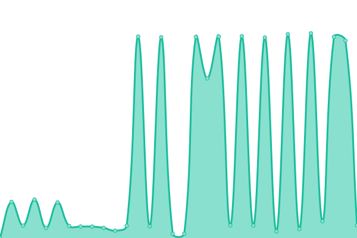
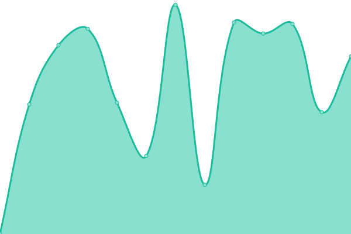

# [📈 Live Status](https://adaptivehealthintelligence.github.io/site-monitoring): <!--live status--> **🟧 Partial outage**

This repository contains the open-source uptime monitor and status page for [Adaptive Health Intelligence](https://adaptivehealthintelligence.org.au/), powered by [Upptime](https://github.com/upptime/upptime).

With [Upptime](https://upptime.js.org), you can get your own unlimited and free uptime monitor and status page, powered entirely by a GitHub repository. We use [Issues](https://github.com/adaptivehealthintelligence/site-monitoring/issues) as incident reports, [Actions](https://github.com/adaptivehealthintelligence/site-monitoring/actions) as uptime monitors, and [Pages](https://adaptivehealthintelligence.github.io/site-monitoring) for the status page.

<!--start: status pages-->
<!-- This summary is generated by Upptime (https://github.com/upptime/upptime) -->
<!-- Do not edit this manually, your changes will be overwritten -->
<!-- prettier-ignore -->
| URL | Status | History | Response Time | Uptime |
| --- | ------ | ------- | ------------- | ------ |
|  MFIT get pt API (DEV) | 🟥 Down | [mfit-get-pt-api-dev.yml](https://github.com/adaptivehealthintelligence/site-monitoring/commits/HEAD/history/mfit-get-pt-api-dev.yml) | 

 998ms
     
 | 

<a href="https://adaptivehealthintelligence.github.io/site-monitoring/history/mfit-get-pt-api-dev">0.00%</a>
    

|  MFIT get pt API (PROD) | 🟩 Up | [mfit-get-pt-api-prod.yml](https://github.com/adaptivehealthintelligence/site-monitoring/commits/HEAD/history/mfit-get-pt-api-prod.yml) | 

 2856ms
     
 | 

<a href="https://adaptivehealthintelligence.github.io/site-monitoring/history/mfit-get-pt-api-prod">44.23%</a>
    

|  PlatinumC | 🟩 Up | [platinum-c.yml](https://github.com/adaptivehealthintelligence/site-monitoring/commits/HEAD/history/platinum-c.yml) | 

 1492ms
     
 | 

<a href="https://adaptivehealthintelligence.github.io/site-monitoring/history/platinum-c">100.00%</a>
    

|  AUTOMATIC | 🟩 Up | [automatic.yml](https://github.com/adaptivehealthintelligence/site-monitoring/commits/HEAD/history/automatic.yml) | 

 1495ms
     
 | 

<a href="https://adaptivehealthintelligence.github.io/site-monitoring/history/automatic">100.00%</a>
    

|  COVID-I Dashboard | 🟩 Up | [covid-i-dashboard.yml](https://github.com/adaptivehealthintelligence/site-monitoring/commits/HEAD/history/covid-i-dashboard.yml) | 

 997ms
     
 | 

<a href="https://adaptivehealthintelligence.github.io/site-monitoring/history/covid-i-dashboard">100.00%</a>
    

|  MotC Project | 🟩 Up | [mot-c-project.yml](https://github.com/adaptivehealthintelligence/site-monitoring/commits/HEAD/history/mot-c-project.yml) | 

 2682ms
     
 | 

<a href="https://adaptivehealthintelligence.github.io/site-monitoring/history/mot-c-project">100.00%</a>
    

|  MotC Navigator Portal | 🟩 Up | [mot-c-navigator-portal.yml](https://github.com/adaptivehealthintelligence/site-monitoring/commits/HEAD/history/mot-c-navigator-portal.yml) | 

 1490ms
     
 | 

<a href="https://adaptivehealthintelligence.github.io/site-monitoring/history/mot-c-navigator-portal">100.00%</a>
    

|  MFIT portal | 🟩 Up | [mfit-portal.yml](https://github.com/adaptivehealthintelligence/site-monitoring/commits/HEAD/history/mfit-portal.yml) | 

 1112ms
     
 | 

<a href="https://adaptivehealthintelligence.github.io/site-monitoring/history/mfit-portal">80.87%</a>
    

|  Adaptive Health Intelligence | 🟩 Up | [adaptive-health-intelligence.yml](https://github.com/adaptivehealthintelligence/site-monitoring/commits/HEAD/history/adaptive-health-intelligence.yml) | 

 1073ms
     
 | 

<a href="https://adaptivehealthintelligence.github.io/site-monitoring/history/adaptive-health-intelligence">100.00%</a>
    

|  BEAT-CF | 🟩 Up | [beat-cf.yml](https://github.com/adaptivehealthintelligence/site-monitoring/commits/HEAD/history/beat-cf.yml) | 

 6713ms
     
 | 

<a href="https://adaptivehealthintelligence.github.io/site-monitoring/history/beat-cf">100.00%</a>
    

<!--end: status pages-->

[**Visit our status website →**](https://adaptivehealthintelligence.github.io/site-monitoring)

## 📄 License

- Powered by: [Upptime](https://github.com/upptime/upptime)
- Code: [MIT](./LICENSE) © [Adaptive Health Intelligence](https://adaptivehealthintelligence.org.au/)
- Data in the `./history` directory: [Open Database License](https://opendatacommons.org/licenses/odbl/1-0/)
